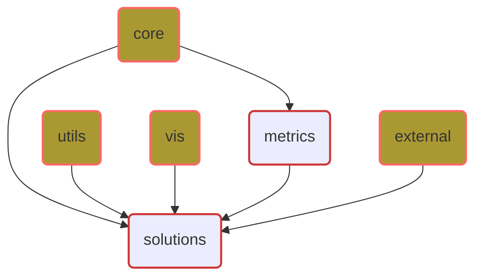

# 프로젝트 아키텍처 및 의존성 문서

**최종 수정 날짜:** 2024년 6월 1일  
**버전:** v0.1.0

이 문서는 프로젝트의 아키텍처 구조와 각 패키지의 역할 및 의존성에 대해 설명한다. 이 정보는 프로젝트의 설계 의도를 이해하고, 각 구성요소 간의 상호작용을 파악하는 데 도움을 준다.

## 아키텍처 개요

프로젝트는 다수의 주요 패키지로 구성되어 있으며, 각 패키지는 독립적인 기능을 수행하고 필요에 따라 다른 패키지와 상호작용한다. 아키텍처는 주로 `core`, `file_io`, `vis`, `metrics`, `externals`, 그리고 `solutions`의 주요 구성 요소로 나뉜다.


```text
cv_utils/
├── src/
│   ├── core/  # Core modules for 3D Geometry and data processing
│   │   ├── operations/  # Modules for operations
│   │   │   ├── __init__.py
│   │   │   ├── hybrid_operations.py  # Basic operations for array types
│   │   │   └── hybrid_math.py        # Mathematical operations for array types
│   │   │
│   │   └── geometry/ # Modules for 3D Geometry
│   │      ├── __init__.py
│   │      ├── rotation.py           # Classes related to 3D rotations
│   │      ├── pose.py               # Classes related to 3D poses
│   │      ├── tf.py                 # Classes for 3D transformations (TBD)
│   │      ├── camera.py             # Classes related to camera models
│   │      ├── image_transform.py    # 2D image transformation functions
│   │      └── geometry_utils.py     # 3D geometric operations
│   │   
│   ├── utils/  # General utility modules
│   │   ├── logger.py (TBD) 
│   │   └── file_utils.py  
│   │
│   ├── vis/  # Modules for visualization
│   │   └── image_edit.py
│   │
│   ├── metrics/  # Modules for evaluation metrics
│   │   └── error_metrics.py 
│   │
│   ├── externals/  
│   │   ├── o3d/
│   │   │   ├── __init__.py
│   │   │   └── mesh_operations.py    # Mesh operations(TBD)
│   │   │
│   │   └── colmap/  # Modules using PyCOLMAP
│   │       ├── __init__.py
│   │       └── stereo_matching.py    # Stereo matching (TBD)
│   │
│   └── solutions/  # Modules using previous packages for specific tasks (TBD)
│      ├── marker/  # Modules related to fiducial markers (TBD)
│      │   ├── __init__.py
│      │   └── marker.py  # Classes related to 3D rotations
│      │
│      └── multiview/  # Modules for multi-view stereo (TBD)
│          ├── __init__.py
│          └── reconstruction.py    
|
├── README.md
├── LICENSE
└── setup.py
```


### Core

`core` 패키지는 프로젝트의 핵심 기능을 담당하며, 3D 기하학 처리 및 데이터 처리 로직을 포함한다.
- **operations**: 배열 타입 데이터에 대한 기본 및 수학적 연산을 제공한다.
- **geometry**: 3D 회전, 포즈 추정, 변환, 카메라 모델링 및 이미지 변환 등 다양한 기하학적 연산을 담당한다.

### Utils

`utils` 패키지는 전체 프로젝트에서 공통적으로 사용되는 유틸리티 기능을 제공한다. 이는 로깅과 파일 입출력 기능을 포함한다.

- **logger.py**: 로깅 기능을 전체 프로젝트에 걸쳐 제공한다.
- **file_utils.py**: 파일 입출력과 관련된 기능을 제공한다.

### Visualization

`vis` 패키지는 데이터 시각화와 관련된 기능을 제공한다. 이는 이미지 편집 및 표시 기능을 포함한다.
- **image_edit.py**: 다양한 형태의 이미지 편집 및 표시 기능을 제공한다.

### Metrics

`metrics` 패키지는 성능 평가를 위한 메트릭을 계산하는 기능을 제공한다.
- **error_metrics.py**: 다양한 오류 메트릭을 계산하여 성능 평가에 사용한다.

### Externals

`external` 패키지는 외부 라이브러리와의 통합을 관리한다. 특히 Open3D와 PyCOLMAP에 의존하는 기능을 포함한다.
- **o3d**: Open3D 라이브러리를 이용한 메시 연산을 제공한다.
- **colmap**: PyCOLMAP을 이용한 스테레오 매칭 기능을 제공한다.

### Solutions

`solutions` 패키지는 특정 애플리케이션 또는 작업을 위해 다른 패키지들의 기능을 활용하여 구현된 기능을 포함한다.
- **markers**: Fiducial Marker와 관련된 기능을 제공한다.
- **multiview**: Multi View Stereo 및 3D 복원과 관련된 기능을 제공한다.

## 의존성 관리

프로젝트는 여러 독립적 및 상호 의존적인 패키지로 구성되어 있다. `core`, `utils`, `vis`, 그리고 `externals`은 독립적인 패키지로 각각의 기능을 자체적으로 수행할 수 있다. 반면, `metrics` 패키지는 `core` 패키지의 기능에 의존적이며, `solutions` 패키지는 `core`, `utils`, `vis`, `metrics`, 그리고 `externals` 패키지 모두에 의존적일 수 있다.

의존성이 명확하고 관리 가능하게 유지되도록 각 패키지의 기능을 세분화하고, 공통 기능은 재사용 가능하도록 설계한다.



