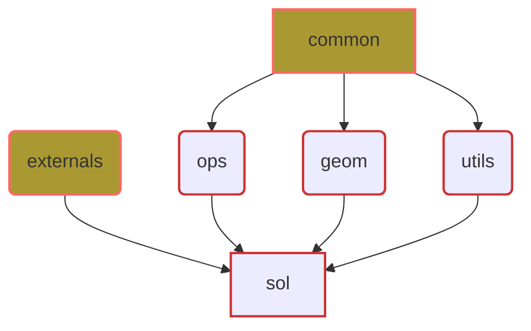

# 프로젝트 아키텍처 및 의존성 문서

**최종 수정 날짜:** 2025년 2월 16일  
**버전:** 0.2.1-alpha

이 문서는 프로젝트의 아키텍처 구조와 각 패키지의 역할 및 의존성에 대해 설명한다. 이 정보는 프로젝트의 설계 의도를 이해하고, 각 구성요소 간의 상호작용을 파악하는 데 도움을 준다.

## 아키텍처 개요

프로젝트는 다수의 주요 패키지로 구성되어 있으며, 각 패키지는 독립적인 기능을 수행하고 필요에 따라 다른 패키지와 상호작용한다. 아키텍처는 주로 `common`, `ops`, `geom`, `utils`, `externals`, 그리고 `sol`의 주요 구성 요소로 나뉜다. 


```text
cv_utils/
├── src/
|   └── cv_utils/
|      |
|      ├── common # Common Package for this library
│      │    ├── __init__.py
|      │    ├── logger.py               # Logger 
|      │    └── constant.py             # Constant
|      │
|      ├── ops/  # Package for array operations
│      │    ├── __init__.py
│      │    ├── uops.py                 # Basic operations for array types
|      │    └── umath.py                # Mathematical operations for array types
|      │
|      ├── geom/ # Package for 3D Geometry
|      │    ├── __init__.py
|      │    ├── rotation.py             # Classes related to 3D rotations
|      │    ├── pose.py                 # Classes related to 3D poses
|      │    ├── tf.py                   # Classes for 3D transformations
|      │    ├── camera.py               # Classes related to camera models
|      │    ├── img_tf.py               # 2D image transformation functions
|      │    └── geom_utils.py           # 3D geometric operations
|      │   
|      ├── utils/  # Package for General utility 
|      │   ├── point_selector.py        # Point Selector Class
|      │   ├── vis.py                   # image utilities for visualization
|      │   ├── io.py                    # File Utilities
|      │   └── metrics.py (TBD)         # Metric functions
|      │
|      ├── externals/ # Package for External Library
|      │   └── o3d
|      │
|      └── sol/  # Package for specific task
|           ├── __init__.py
|           ├── marker               # Classes related to Fiducial Marker
|           └── mvs                  # Modules to Multiview Stereo 
|
├── README.md
├── LICENSE
├── features/ # executable codes 
├── scripts/  # shell scripts
└── setup.py
```


### Common
`common` 패키지는 프로젝트 구성을 위한 공통적인 기능을 제공한다.
- **logger.py**: 로깅 기능을 전체 프로젝트에 걸쳐 제공한다.
- **constant.py**: 프로젝트 전체의 사용을 위해 정의된 상수를 제공한다.


### Operations
`ops` 패키지는 배열 타입 데이터에 대한 기본 및 수학적 연산을 제공한다.
- **uops.py**: 넘파이와 파이토치 배열을 대응하는 기본 연산 함수를 제공한다.
- **umath.py**: 넘파이와 파이토치 배열을 대응하는 수학적 연산 함수를 제공한다.


### Geometry
`geom` 패키지는 3D 회전, 포즈 추정, 변환, 카메라 모델링 및 이미지 변환 등 다양한 기하학적 연산을 담당한다.
- **img_tf.py**: 2차원 이미지 변환(Transformation) 기능을 제공한다. 
- **camera.py**: 다양한 카메라 모델링을 제공한다.
- **rotation.py**: 3D Rotation 클래스를 제공한다.
- **pose.py**: 6-DOF Pose 클래스를 제공한다.
- **tf.py**:  6-DOF Transform 클래스를 제공한다.
- **geom_utils.py**: 기하학적 알고리즘을 구현한 함수들을 제공한다.


### Utils
`utils` 패키지는 전체 프로젝트에서 공통적으로 사용되는 유틸리티 기능을 제공한다.
- **io.py**: 파일 입출력과 관련된 기능을 제공한다.
- **vis.py**: 다양한 형태의 이미지 편집 및 표시 기능을 제공한다.
- **point_selector.py**: 사용자에게 이미지에서 포인트를 선택하는 GUI를 제공한다.
- **metrics.py**: 다양한 메트릭을 계산하여 성능 평가에 사용한다.


### Externals
`externals` 패키지는 외부 라이브러리와의 통합을 관리한다.
- **o3d**: Open3D 라이브러리를 이용한 메시 연산을 제공한다.


### Solutions
`sol` 패키지는 특정 애플리케이션 또는 작업을 위해 다른 패키지들의 기능을 활용하여 구현된 기능을 포함한다.
- **marker**: Fiducial Marker와 관련된 기능을 제공한다.
- **mvs**: Multi View Stereo 및 3D 복원과 관련된 기능을 제공한다.


## 의존성 관리
의존성이 명확하고 관리 가능하게 유지되도록 각 패키지의 기능을 세분화하고, 공통 기능은 재사용 가능하도록 설계한다.

### 패키지간 의존성 그래프

