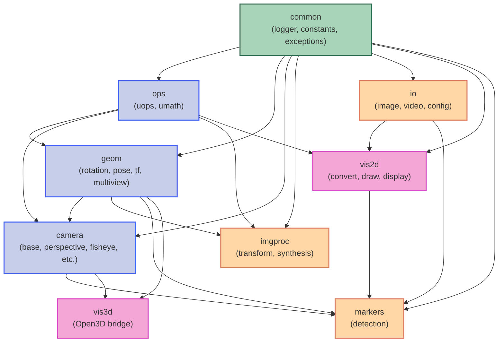

# Project Architecture and Dependency Documentation

**Last Updated:** 2025-11-03
**Current Version:** 0.3.2

This document describes the project's architectural structure, the roles of each package, and their dependencies. This information helps understand the design intent and the interaction between components.

## Architecture Overview

The project consists of multiple major packages, each performing independent functions and interacting with other packages as needed. The architecture is primarily divided into key components: `common`, `ops`, `geom`, `camera`, `imgproc`, `io`, `vis2d`, `vis3d`, and `markers`.

## Directory Structure

```text
spatialkit/
├── src/
│   └── spatialkit/
│      │
│      ├── common/           # Common package for this library
│      │    ├── __init__.py
│      │    ├── logger.py    # Logging utilities
│      │    ├── constant.py  # Constants
│      │    └── exceptions.py # Exception hierarchy
│      │
│      ├── ops/              # Unified array operations
│      │    ├── __init__.py
│      │    ├── uops.py      # Basic operations for array types
│      │    └── umath.py     # Mathematical operations for array types
│      │
│      ├── geom/             # 3D geometry primitives
│      │    ├── __init__.py
│      │    ├── rotation.py  # 3D rotation classes
│      │    ├── pose.py      # 6-DOF pose classes
│      │    ├── tf.py        # 3D transformation classes
│      │    ├── epipolar.py  # Epipolar geometry
│      │    ├── multiview.py # Multi-view geometry algorithms
│      │    └── pointcloud.py # Point cloud utilities
│      │
│      ├── camera/           # Camera models
│      │    ├── __init__.py
│      │    ├── base.py      # Base camera class
│      │    ├── radial_base.py # Radial distortion base
│      │    ├── perspective.py # Perspective camera
│      │    ├── fisheye.py   # Fisheye camera models
│      │    ├── omnidirectional.py # Omnidirectional camera
│      │    ├── doublesphere.py # Double sphere camera
│      │    └── equirectangular.py # Equirectangular camera
│      │
│      ├── imgproc/          # Image processing
│      │    ├── __init__.py
│      │    ├── transform.py # 2D image transformations
│      │    └── synthesis.py # Image synthesis utilities
│      │
│      ├── io/               # File I/O operations
│      │    ├── __init__.py
│      │    ├── image.py     # Image I/O
│      │    ├── video.py     # Video I/O with lazy loading
│      │    └── config.py    # Configuration file I/O
│      │
│      ├── vis2d/            # 2D visualization
│      │    ├── __init__.py
│      │    ├── convert.py   # Image conversion utilities
│      │    ├── draw.py      # Drawing functions
│      │    └── display.py   # Display utilities
│      │
│      ├── vis3d/            # 3D visualization (Open3D)
│      │    ├── __init__.py
│      │    ├── common.py    # Open3D type aliases
│      │    ├── components.py # 3D geometry creation
│      │    └── o3dutils.py  # Open3D utility functions
│      │
│      └── markers/          # Fiducial marker detection
│           ├── __init__.py
│           ├── marker.py    # Marker data classes
│           ├── base.py      # Base detector class
│           ├── opencv_detector.py # OpenCV marker detector
│           ├── apriltag_detector.py # AprilTag detector
│           └── stag_detector.py # STag detector
│
├── tests/               # Test suite mirroring src structure
├── examples/            # Example scripts
├── docs/                # Documentation
├── README.md
├── LICENSE
└── pyproject.toml
```

## Package Descriptions

### Common
The `common` package provides foundational functionality for the entire project.
- **logger.py**: Provides logging functionality across the entire project (LOG_DEBUG, LOG_INFO, LOG_WARN, LOG_ERROR, LOG_CRITICAL).
- **constant.py**: Defines constants for project-wide use.
- **exceptions.py**: Defines the hierarchical exception system used throughout spatialkit.

### Operations (ops)
The `ops` package provides basic and mathematical operations for array-type data with unified interfaces for both NumPy and PyTorch.
- **uops.py**: Provides unified basic operation functions for NumPy and PyTorch arrays (type checking, conversion, array construction, shape manipulation).
- **umath.py**: Provides unified mathematical operation functions for NumPy and PyTorch arrays (linear algebra, trigonometry, statistics).

**Key Features:**
- Type-agnostic operations that work seamlessly with both NumPy and PyTorch
- Automatic dtype handling with intelligent promotion
- Preserves input array type (NumPy in → NumPy out, Tensor in → Tensor out)

### Geometry (geom)
The `geom` package handles various geometric operations including 3D rotations, pose estimation, transformations, and multi-view geometry.
- **rotation.py**: Provides 3D Rotation class with support for SO3, so3, quaternions (xyzw/wxyz), and roll-pitch-yaw representations.
- **pose.py**: Provides 6-DOF Pose class (rotation + translation).
- **tf.py**: Provides 6-DOF Transform class.
- **epipolar.py**: Epipolar geometry functions (fundamental matrix, essential matrix).
- **multiview.py**: Multi-view geometry algorithms (triangulation, PnP, homography).
- **pointcloud.py**: Point cloud processing utilities.

**dtype Policy:**
- All geometry classes internally store data as **float32** for memory efficiency and performance
- Input accepts any dtype (float16/32/64), automatically converted to float32
- When applying transformations to external arrays (e.g., `apply_pts3d`), result dtype matches input array dtype

### Camera
The `camera` package provides various camera models and projection operations.
- **base.py**: Abstract base Camera class defining the camera interface.
- **radial_base.py**: Base class for radial distortion models.
- **perspective.py**: Perspective (pinhole) camera model.
- **fisheye.py**: Fisheye camera models (OpenCV, ThinPrism).
- **omnidirectional.py**: Omnidirectional camera model.
- **doublesphere.py**: Double sphere camera model for wide FOV.
- **equirectangular.py**: Equirectangular projection camera.

**Supported Models:**
- Perspective (standard pinhole)
- OpenCV Fisheye
- Thin Prism Fisheye
- Omnidirectional (Scaramuzza model)
- Double Sphere
- Equirectangular

### Image Processing (imgproc)
The `imgproc` package provides image processing and transformation utilities.
- **transform.py**: 2D image transformation functions (homography-based warping, etc.).
- **synthesis.py**: Image synthesis utilities.

### I/O Operations (io)
The `io` package provides file input/output operations.
- **image.py**: Image I/O supporting PNG, JPG, TIFF, PGM formats.
- **video.py**: Video I/O with lazy loading support for large files (VideoReader class).
- **config.py**: Configuration file I/O for JSON and YAML formats.

### 2D Visualization (vis2d)
The `vis2d` package provides 2D image visualization utilities.
- **convert.py**: Image conversion utilities (float_to_image, normal_to_image, concat_images, rainbow color generation).
- **draw.py**: Drawing functions (circles, lines, polygons, correspondences).
- **display.py**: Display utilities (show_image, show_two_images, show_correspondences).

### 3D Visualization (vis3d)
The `vis3d` package provides 3D visualization using Open3D.
- **common.py**: Open3D type aliases for better type hints.
- **components.py**: 3D geometry creation (coordinate frames, camera frustums, indicators).
- **o3dutils.py**: Open3D utility functions for visualization and mesh operations.

**Note:** This package bridges spatialkit geometry classes with Open3D visualization.

### Markers
The `markers` package provides fiducial marker detection capabilities.
- **marker.py**: Marker data classes and enumerations (Marker, FiducialMarkerType).
- **base.py**: Abstract base MarkerDetector class.
- **opencv_detector.py**: OpenCV-based marker detector (ArUco).
- **apriltag_detector.py**: AprilTag marker detector.
- **stag_detector.py**: STag marker detector.

**Supported Marker Types:**
- ArUco (via OpenCV)
- AprilTag (multiple tag families)
- STag

## Dependency Management

Dependencies are kept clear and manageable by subdividing each package's functionality and designing common features to be reusable.

### Inter-Package Dependency Graph



### Dependency Layers

**Layer 1: Foundation**
- `common` - No internal dependencies, provides logging, constants, and exceptions

**Layer 2: Core Operations**
- `ops` - Depends on `common`
- Provides unified NumPy/PyTorch operations

**Layer 3: Geometry & Camera**
- `geom` - Depends on `common`, `ops`
- `camera` - Depends on `common`, `ops`, `geom`
- Core 3D geometry and camera modeling

**Layer 4: Processing & I/O**
- `imgproc` - Depends on `common`, `ops`, `geom`
- `io` - Depends on `common`
- Image/video processing and file I/O

**Layer 5: Visualization & Applications**
- `vis2d` - Depends on `common`, `ops`, `io`
- `vis3d` - Depends on `geom`, `camera` (independent bridge to Open3D)
- `markers` - Depends on `common`, `geom`, `camera`, `io`, `vis2d`

### Design Principles

1. **Layered Architecture**: Lower layers have no knowledge of higher layers
2. **Minimal Dependencies**: Each package minimizes its dependencies
3. **Clear Interfaces**: Well-defined public APIs with `__all__` declarations
4. **Type Consistency**: Unified operations maintain input/output type consistency
5. **Exception Hierarchy**: Comprehensive, domain-specific exception system
6. **Float32 Policy**: Geometry classes use float32 internally for efficiency

## Key Architectural Decisions

### Unified Operations Pattern
The `ops` package provides a single interface for both NumPy and PyTorch, enabling:
- Writing algorithm code once that works with both array types
- Seamless integration with deep learning pipelines
- Consistent behavior across different array backends

### Geometry Class Design
Geometry classes (`Rotation`, `Pose`, `Transform`) follow a consistent pattern:
- Multiple constructors for different representations (e.g., `from_mat3`, `from_quat`)
- Immutable internal state (float32 NumPy arrays)
- Type-preserving transformations (when applied to external data)
- Rich API for conversions between representations

### Camera Model Abstraction
The camera hierarchy provides:
- Abstract base class defining the projection/unprojection interface
- Specialized implementations for different distortion models
- Factory methods for common construction patterns
- Support for both forward and inverse projections

### Exception-Driven Error Handling
All validation uses exceptions (never `assert` for user input):
- Hierarchical exception types for selective catching
- Clear, actionable error messages
- Consistent validation patterns across the codebase

## Version History

- **v0.3.0-alpha** (2025-11-03): Restructured packages, added camera models, improved exception handling
- **v0.2.1-alpha** (2025-01-30): Added exception hierarchy, migrated to uv
- **v0.2.0-alpha** (2024-12): Initial unified operations, geometry classes
